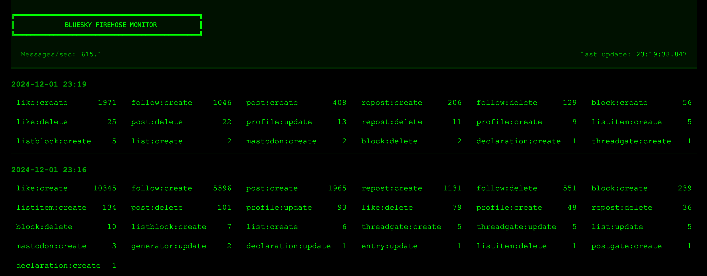

# Flask Web Application

## Setup Instructions

1. Install `uv`:
```bash
curl -LsSf https://astral.sh/uv/install.sh | sh
```

2. Create a virtual environment and install dependencies:
```bash
uv sync
source .venv/bin/activate
```

3. Run the application:
```bash
uv run app.py
```

## Project Structure


- `app.py`: Main Flask application
- `templates/`: HTML templates
- `pyproject.toml`: Project configuration and dependencies

## Dependencies
- Flask
- Python 3.10+
